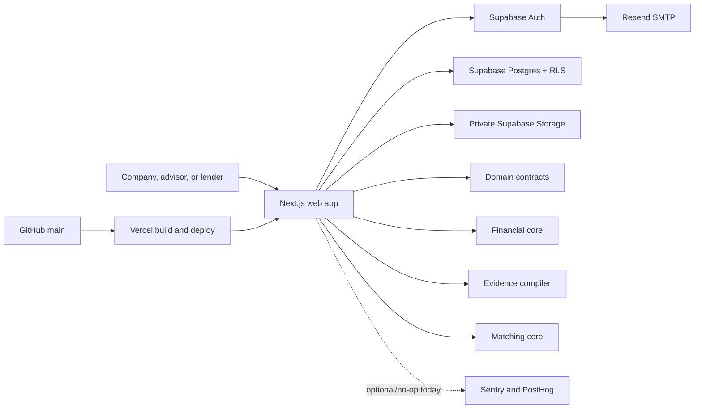

# Offroad Capital: Product and Engineering Handoff

> Current as of 18 August 2026, `main` after PRs #41, #44, #46, #47, #48, #49
> and this documentation PR (previous baseline: `30b87f7`, PR #40).
>
> This is the fastest complete orientation document for a new product, design,
> engineering, data, credit, security, or AI session. It describes both the
> intended product and the code that actually exists today. When it conflicts
> with an older build note, this file and the current code take precedence.

### Engineering update: bulletproof foundations, 24 August 2026

The founder approved the end-to-end hardening plan in
[`docs/build/BULLETPROOF_EXECUTION_PLAN.md`](docs/build/BULLETPROOF_EXECUTION_PLAN.md).
The first focused increment establishes the contracts required before expanding
the pipeline:

- origination taxonomy v2 separates capital need, repayment source, backing,
  company obligation, distributed security, structure mechanism, capital
  vehicle, provider type, distribution route, and credit enhancement;
- FIDC is a capital vehicle, never the company's obligation or a synonym for a
  receivables transaction;
- six operational case outcomes are independent from the credit verdict;
- a unified manifest can fingerprint source versions, model and prompt policy,
  deterministic engines, market date, templates, matching, and outputs;
- the gold-case contract now covers the complete eight-layer evaluation surface;
- the production-used legacy catalogue has an explicit compatibility adapter to
  the new taxonomy.

The raw-document runner, workload-attested manifest, first full corporate anchor,
claim-level publication controls and parametric case factory now exist. The remaining
measured increments are the founder and independent economic review of the anchor,
the dedicated receivables/FIDC track, governed retrieval and staging promotion
gates. Do not report those remaining items as live until their
acceptance evidence is recorded.

### Engineering update: governed case worker, 24 August 2026

The economic pipeline no longer depends on a browser render. When the final
document job reaches a terminal state, Postgres enqueues one `case_analysis`
job for the run. The ECS worker receives borrower evidence and private mandate
data through a short-lived job capability, executes `@offroad/case-engine`,
and atomically records the immutable manifest and latest case snapshot.

The confidentiality boundary is deliberate. Full provider identities,
constraints, and fit explanations remain in the private processing-job result.
The borrower workspace receives only fit counts, structural exclusions,
information that could unlock a fit, and Offroad data gaps. Browser identities
can read their own finished snapshot but can no longer attest or replace it.
The web path can still build a deterministic preview while processing is in
flight, without a model call or access to the private mandate directory.

### Engineering update: claim registry and publication gate, 24 August 2026

Claims are no longer accepted as one opaque brief. `@offroad/case-understanding`
builds an individual registry with exact fingerprints, cited support and artifact
dependencies. Numeric audit is deterministic. Semantic audit is performed by a
second model on a different provider from the writer and receives only the claim
and its reconciled support. A semantic review that is absent, malformed or
uncertain fails closed.

Material judgments require an explicit human decision. That decision is
append-only and tied to the exact claim fingerprint, immutable source manifest
and registry fingerprint. A changed claim or source makes the prior approval
stale. Any failed or pending material claim blocks the teaser, credit profile,
investor package and outbound data room, while preserving the internal brief for
review. Changing one fact identifies every dependent claim and artifact.

Persistence lives in `claim_decisions`. Direct writes are not granted. The public
command is a security-invoker wrapper over a private implementation that validates
the current snapshot, tenant, role and exact claim. Worker reads use the active
job capability. Relevant migrations are `20260824180255`, `20260824180448` and
`20260824180822`; generated application types include both registry commands.

### Engineering update: parametric case factory, 24 August 2026

`@offroad/case-factory` creates governed synthetic cases from one declarative economic
scenario. Company identity, financial history, debt, capital request, collateral,
optional loan tape and capital-provider mandates drive every generated document,
candidate and expected answer. Gold is captured before omissions, weak anchors,
conflicts or hostile text are injected, so the test never erases its own answer.

The initial library contains a clean growth case, a dirty working-capital room and a
250-line receivables case. They run through all nine stages of `@offroad/case-engine`.
The suite proves exact debt calculations, full-criteria mandate screening, bilingual
economic identity, conflict retention and isolation of hostile document text. Loan
tapes tie exactly to total balance, overdue balance and top-obligor concentration.

An unverified anchor remains available to a reviewer, but cannot support publication.
The deterministic claim auditor blocks a material claim when its direct fact or any
calculation in its lineage reaches an unverified anchor. Handcrafted anchors remain a
separate class and are not replaced by generated cases. The next vertical is the
dedicated receivables and FIDC playbook with specialist-reviewed anchors and at least
twenty scenarios.

### Update de produto: intake guiado, 22 August 2026

The borrower and advisor intake now has one guided entry instead of an up-front
choice between documents and manual typing. The implemented sequence is:

```text
Funding objective
  → essential transaction outline
  → operation-specific information request list
  → private upload and automatic classification
  → evidence-linked review
```

The request list is built from the existing `@offroad/credit-playbook` archetype
and presented in three levels: minimum, recommended, and ideal. Missing material
does not block the user from starting. Collateral, target cost, and instrument
preferences are optional because recommending structure is part of Offroad's
work, not a prerequisite the company must guess. Manual entry remains a recovery
path when document processing cannot propose fields, not a competing first
journey.

## 1. Executive summary

Offroad Capital is a private-credit origination and market-access platform,
powered by specialized AI and current market intelligence. It is not an “AI
platform” in the abstract and it is not a lender.

The product takes fragmented company and transaction information, turns it into
a structured, evidence-linked private-credit opportunity, and identifies capital
providers whose mandates are aligned with the transaction.

The product serves three participant groups:

1. **Companies** seeking capital beyond traditional channels.
2. **Advisors/originators** submitting and managing opportunities on behalf of
   companies.
3. **Private-credit investors and lenders**, including funds, FIDCs, factors,
   managers, and alternative lenders.

The intended transformation is:

```text
Capital need
  → documents and company information
  → organization and reconciliation
  → debt-capacity analysis
  → proposed financing structure
  → standardized investor materials
  → mandate screening and ranking
  → qualified introduction
```

The product boundary ends at **qualified introduction**. Offroad must not imply
that it performs or guarantees final underwriting, diligence, negotiation,
documentation, funding, or closing.

## 2. Product positioning and approved message

### Core category

**AI-driven private-credit origination and market access.**

In Portuguese, avoid describing Offroad as “uma plataforma de IA.” Preferred
framing: **“Originação de crédito privado impulsionada por IA.”**

### Current public value proposition

- Companies reach the market better prepared and gain access to capital that
  may be outside their existing network.
- Advisors originate with more consistency, speed, and reach.
- Investors receive new, structured opportunities aligned with mandate, ticket,
  sector, structure, risk profile, and return requirements.
- Evidence remains linked to the underlying source.
- Deterministic financial calculations must remain separate from generative AI.

### Product signature

> Structured for the market. Matched to the mandate.

### Brand statement

> The best opportunities are rarely on the obvious path. Go Offroad.

### Tone and wording rules

- Institutional, precise, credible, and suitable for CFOs, founders, advisors,
  credit funds, FIDC managers, and investment professionals.
- Never promise approval, funding, closing, or guaranteed investor interest.
- Do not describe ranking as approval probability.
- Do not collapse companies, advisors, and investors into one generic user.
- Avoid consumer-SaaS language such as “enter the workspace” in public copy.
- Avoid futuristic AI clichés, excessive glow, fake scores, fake clients, fake
  statistics, and decorative charts without analytical meaning.
- Use “advisor” as the participant label; an advisor/originator is an origination
  channel and may submit on behalf of a company, not a separate economic case.

## 3. Product principles and non-negotiable invariants

1. **Evidence before assertion.** Every material fact should retain source,
   anchor, period, information class, confidence, and review state.
2. **No invented data.** If information cannot be extracted or reconciled, show
   the gap. Never synthesize a fact to make a workflow look complete.
3. **Period integrity.** Historical, interim, current, and projected information
   must remain distinct.
4. **Source hierarchy without data loss.** Audit, reviewed accounting, ERP,
   management, declarations, and projections can have different authority, but
   conflicting sources must remain visible.
5. **Deterministic mathematics.** LLMs may explain or orchestrate; they may not be
   the source of financial calculations.
6. **Tenant isolation.** Every private business object carries
   `organization_id`; access is enforced in Postgres with RLS, not only in UI.
7. **Explicit disclosure.** Private workspace data is not a discovery surface.
   Market-facing projections and grants must be deliberate and recipient-scoped.
8. **Qualified introduction is the endpoint.** No downstream status should be
   inferred from silence or UI animation.
9. **Privacy-first telemetry.** Financial values, documents, identities, emails,
   tokens, and request payloads do not belong in analytics or error telemetry.
10. **Bilingual economic identity.** PT-BR and EN-US may differ in prose, never in
    the underlying economic payload.

## 4. Current production status

### Live infrastructure

| Area | Current state |
|---|---|
| Production | `https://offroad.capital` |
| Canonical locale | `pt-BR`; `en-US` is also implemented |
| GitHub | `carlosevg100/offroad` |
| Main branch | `main`, PR-based workflow |
| Current handoff commit baseline | `30b87f7` |
| Vercel | project `carlosevg100-9887s-projects/offroad`; Git integration active |
| DNS | GoDaddy remains registrar/DNS; apex and `www` point to Vercel |
| Supabase organization | `Mr. Pickles` |
| Supabase project | `offroad-development` |
| Supabase project ref | `ifnogpksgdadruooqydi` |
| Supabase region/database | `sa-east-1`, PostgreSQL 17 |
| Transactional email | Supabase Auth through Resend SMTP and verified `offroad.capital` domain |
| Object storage | private Supabase bucket `opportunity-documents` |
| Railway | not currently used |
| Sentry | adapter implemented; external project/DSN not configured |
| PostHog | privacy-safe adapter implemented; external project/token not configured |

### What is operational today

- Premium bilingual marketing site, responsive hero video, product narrative,
  audiences, product film, trust section, CTA, metadata, favicon, manifest,
  Open Graph, Twitter metadata, and JSON-LD.
- Email/password signup with participant selection before identity entry.
- Six-digit email verification and password recovery codes.
- Separate onboarding journeys for companies, advisors/originators, and capital
  providers.
- Authenticated institutional workspace with organization-specific navigation.
- Company/advisor pipeline and capital-provider fund/mandate dashboard.
- New-case choice between document-first intake and manual entry.
- Private multi-format upload and an evidence-oriented assisted-review UI.
- Accept, edit, reject, N/A, comments, source link, confidence, and issue review.
- Rede Horizonte acceptance package matched by filename and **server-verified**
  SHA-256; document removal while the session is open.
- Atomic, idempotent intake commands in Postgres (processing, review,
  confirmation); every case value derived from confirmed candidates.
- Core database model, RLS + FORCE RLS on all tables, audit triggers, private
  storage, and typed client.
- Initial deterministic financial, matching, evidence, and domain packages.
- Vercel preview/production deployment; GitHub quality gate with three required
  jobs (`check`, `database`, `e2e`), the E2E job runs the whole borrower
  journey on a local Supabase stack.
- Localized 404/error pages; placeholder controls disabled honestly.

### What is not operational yet

- General-purpose OCR, layout parsing, native Office parsing, and LLM extraction
  for arbitrary customer document sets.
- Malware scanning, macro inspection, decompression protection, PDF sanitization,
  and isolated parsing workers.
- Full spreading/reconciliation UI and complete financial statement model.
- Production-grade credit capacity, downside, structuring, covenant, collateral,
  and scenario workbenches.
- Generated teasers, lender packages, IMs, term sheets, and evidence indices.
- Persisted production matching runs, fund discovery, alerts, access requests,
  disclosure approval, and qualified-introduction workflow.
- Agent kernel, tool gateway, orchestration, evaluations, budgets, or kill switch.
- Offroad internal admin, four-eyes queues, assignment controls, and break-glass.
- Sentry/PostHog projects, alerting, SLO dashboards, Railway workers, or queues.
- Automated accessibility and cross-browser suites; E2E for the originator and
  capital-provider journeys (the company journey is covered).
- MFA/AAL2 product flow; local Supabase MFA is currently disabled.
- Public indexing; metadata intentionally remains `noindex`/`nofollow`.

## 5. Architecture at a glance

The current implementation is a TypeScript modular monolith. The web app is
server-rendered by Next.js and talks directly to Supabase through scoped server
and browser clients. Domain packages contain deterministic or typed logic that
must remain portable.



### Why this architecture

- It keeps the first vertical slice deployable and reviewable.
- Postgres RLS is the actual authorization boundary.
- Financial logic can be tested independently from UI and language.
- Evidence and matching contracts can evolve without beginning with premature
  microservices.
- Future workers or agent runtimes can be introduced when document isolation,
  long-running workflows, or workload identities require them.

Do not introduce microservices, queues, or an agent framework simply for
symmetry. Introduce each boundary with an explicit job, threat model, and gate.

## 6. Technology stack

### Runtime and repository

| Technology | Version/use |
|---|---|
| Node.js | 24.x; `.nvmrc` is authoritative |
| pnpm | 10.32.1 |
| Turborepo | 2.10.10 |
| TypeScript | 5.9.3, strict, no emit in typecheck |
| Vitest | 4.1.10 |
| GitHub Actions | install, lint, typecheck, test, build on PRs to `main` |

### Web application

| Technology | Version/use |
|---|---|
| Next.js | 16.3.1 App Router and Server Actions |
| React / React DOM | 19.2.8 |
| next-intl | 4.13.6; `pt-BR` and `en-US` |
| Zod | 4.4.3; forms, events, and domain contracts |
| Lucide React | interface icons |
| CSS | custom `globals.css` + `offroad-premium.css`; not utility-first UI |
| Fonts | Inter for interface, Newsreader available for editorial treatment |
| Media | MP4/WebM hero loop plus poster; reduced-motion fallback |

### Data and external services

| Technology | Version/use |
|---|---|
| Supabase JS | 2.112.3 |
| `@supabase/ssr` | 0.12.4 |
| PostgreSQL | 17 with RLS, composite tenant FKs, triggers, RPCs |
| Supabase Auth | password, email OTP, recovery OTP, SSR cookies |
| Supabase Storage | private files, 50 MiB limit, scoped access |
| Resend | SMTP provider configured inside Supabase, not called by an app SDK |
| Vercel | Next.js preview and production hosting |
| Sentry | 10.70.0 dependency; safe no-op without DSN |
| PostHog | 1.416.0 dependency; safe no-op without token |
| Decimal.js | deterministic financial and matching math |

### Important Next.js rule

This repository uses a newer Next.js version with breaking conventions. Before
editing `apps/web`, read `apps/web/AGENTS.md` and the relevant local guide under
`apps/web/node_modules/next/dist/docs/`. Do not rely on remembered APIs.

## 7. Repository map

```text
offroad/
├── apps/web/                         Next.js application
│   ├── messages/                     PT-BR and EN-US message catalogs
│   ├── public/                       Brand, icons, social image, hero media
│   ├── e2e/                          Playwright journey (runs in CI on a local stack)
│   ├── src/app/[locale]/             Public, auth, onboarding, app routes, error/not-found
│   ├── src/components/               Site components; intake/ = document-first UI
│   ├── src/config/brand.ts           Central public identity and metadata
│   ├── src/i18n/                     Locale routing and request config
│   ├── src/lib/auth/                 Registration and workspace guards
│   ├── src/lib/intake/               Intake operations, builders, parsing, upload client
│   ├── src/lib/observability/        Allowlist and privacy scrubbers
│   ├── src/lib/supabase/             Browser/server/proxy clients
│   ├── src/types/database.ts         Generated Supabase TypeScript types
│   ├── src/app/globals.css           Base and legacy product styles
│   └── src/app/offroad-premium.css   Current premium visual layer
├── packages/
│   ├── credit-ontology/              What the intelligence looks for: taxonomy, fields, chart of accounts, rules R1–R17, policies (P1 F0)
│   ├── document-intelligence/        Pure pipeline core: layer/candidate/exception/brief contracts, anchor verifier, normalizer (P1 F0)
│   ├── model-gateway/                Only door to LLMs: Anthropic + OpenAI via API, no-Haiku policy, budgets, cassettes (P1 F0)
│   ├── evals/                        Evaluation harness, metrics, baseline CLI (P1 F0)
│   ├── domain-contracts/             Zod contracts and shared domain schemas
│   ├── evidence-compiler/            Claim coverage and support rules
│   ├── financial-core/               Decimal financial calculations
│   ├── matching-core/                Deterministic mandate filters/ranking
│   └── testing-fixtures/             Synthetic fixtures + assets/rede-horizonte (8 files) + gold/rede-horizonte (G1 expectations)
├── supabase/
│   ├── migrations/                   Ordered schema and security history
│   ├── templates/                    Auth confirmation/recovery emails
│   ├── tests/rls_non_interference.sql
│   └── config.toml                   Local Supabase/Auth/Storage configuration
├── docs/
│   ├── product/                      Versioned Blueprint v3.0 PDF
│   ├── adr/                          Architecture decisions (0001–0008)
│   └── build/                        Plan, state, evidence, risks, decisions, access
├── AGENTS.md / CLAUDE.md             Operating rules for agents and humans
├── .github/                          CI (check, database, e2e), CODEOWNERS, templates
├── .env.example                      Public environment variable contract
├── package.json                      Monorepo commands and versions
├── pnpm-workspace.yaml
└── turbo.json
```

### Documentation status

`docs/build/*` was refreshed on 18 Aug 2026 to this baseline (state, evidence,
risks, decisions, access). ADRs 0004–0007 record the positioning, palette,
migration/CI workflow and intake decisions. Keep ledgers and this file in the
same PR as the change (AGENTS.md §5).

## 8. Route map and user experiences

All product routes are locale-prefixed. Locale detection is deliberately off;
`pt-BR` is the default.

| Route | Purpose |
|---|---|
| `/pt-BR`, `/en-US` | Public institutional website |
| `/:locale/demo` | Product demonstration surface |
| `/:locale/signup` | Participant selection and account creation |
| `/:locale/signup/verify` | Six-digit signup verification |
| `/:locale/login` | Password login |
| `/:locale/forgot-password` | Recovery request |
| `/:locale/forgot-password/verify` | Six-digit recovery verification |
| `/:locale/forgot-password/update` | New password |
| `/:locale/onboarding` | Role-specific institutional onboarding |
| `/:locale/app` | Authenticated organization dashboard |
| `/:locale/app/new` | New case: documents first or manual |
| `/:locale/app/opportunities/:id` | Current opportunity/credit-room summary |
| `/:locale/auth/confirm` | Supabase auth callback |
| `/robots.txt`, `/sitemap.xml` | Technical SEO surfaces |

### Public website

Primary implementation: `apps/web/src/app/[locale]/page.tsx`.

Key components:

- `site-header.tsx`: localized navigation, create account, login, Book a Demo.
- `hero-background-video.tsx`: city/road hero loop and visual overlays.
- `hero-value-rotator.tsx`: rotating workflow value statement.
- `capability-reel.tsx`: product capabilities after the hero.
- `product-film.tsx`: current interactive product narrative.
- `brand-mark.tsx`: official symbol/wordmark treatment.

Brand and metadata live in `apps/web/src/config/brand.ts`; never scatter canonical
domain, title, description, category, or email across components.

### Authentication

- Signup profiles: `company`, `originator`, `capital_provider`.
- No Google or Microsoft social login by product decision.
- Password: 8–128 characters, at least one lowercase, one uppercase, and one
  punctuation/symbol character.
- Signup and recovery use six-digit OTPs, valid for ten minutes.
- The temporary email cookie is HTTP-only, SameSite Lax, and expires after
  fifteen minutes.
- Workspace creation is performed by
  `initialize_professional_onboarding` after identity verification.
- `requireUser` and `requireWorkspace` enforce protected routes server-side.

Important files:

- `apps/web/src/lib/auth/registration.ts`
- `apps/web/src/app/[locale]/signup/actions.ts`
- `apps/web/src/app/[locale]/login/actions.ts`
- `apps/web/src/app/[locale]/forgot-password/actions.ts`
- `apps/web/src/lib/auth/workspace.ts`

### Role-specific onboarding

Implementation:

- `apps/web/src/app/[locale]/onboarding/page.tsx`
- `apps/web/src/app/[locale]/onboarding/actions.ts`

Journeys:

- **Company:** organization/company, funding context, documents, review.
- **Advisor/originator:** advisory organization, represented company, funding,
  documents, authority context, review.
- **Capital provider:** organization, fund, mandate, routing contacts, review.

Onboarding progress is persisted in `onboarding_progress`; users can return and
edit sections. Completed onboarding routes users to their organization workspace.

### Authenticated workspace

- `apps/web/src/app/[locale]/app/layout.tsx`: left navigation and organization
  shell.
- `apps/web/src/app/[locale]/app/page.tsx`: borrower/originator pipeline or
  provider dashboard.
- `apps/web/src/app/[locale]/app/new/*`: new opportunity and document intake.
- `apps/web/src/app/[locale]/app/opportunities/[opportunityId]/page.tsx`:
  current credit-room overview.

The opportunity rail shows intended modules, snapshot, documents, capacity,
structure, outputs, and matching, but most are placeholders today, not complete
workbenches.

## 9. Document-first intake

### Intended experience

Before a long form, the user chooses:

1. **Start with documents** (recommended).
2. **Fill in manually.**

The document path supports PDF, CSV, XLS/XLSX, DOC/DOCX, PPT/PPTX, TXT, JPG,
JPEG, PNG, and WebP, up to 50 MB per file. A browser-side SHA-256 is recorded when
the file metadata is persisted; when the session is processed the server downloads
each object, recomputes the hash, stores the verified value
(`source_documents.sha256_verified_at`) and raises an explicit integrity issue if
the browser's claim differed. Documents can be removed while the session is open
(before confirmation); once confirmed they are evidence and cannot be deleted
through the Data API.

The review model supports:

- raw and normalized values;
- field group and field path;
- source document and source anchor;
- information class and evidence rank;
- confidence and extraction method;
- primary/alternative candidates;
- accept, edit, reject, N/A, comment;
- conflict, missing, and validation issues;
- final confirmation before creating the opportunity.

Important files:

- `apps/web/src/lib/intake/server.ts`, the intake operations shared by both
  entry points (start, process, accept, review, resolve, confirm, load); tenant
  scope always comes from the verified session.
- `apps/web/src/lib/intake/case.ts`, pure builders (candidate/issue/evidence
  rows, `deriveCase`, bounded opportunity title) and `format.ts` (locale-aware
  number parsing and value rendering), both unit-tested.
- `apps/web/src/components/intake/`, `IntakeStartChoice`, `IntakeCollect`,
  `IntakeReview`, `DocumentIntakeUploader` (client). Copy comes from the
  `Intake` namespace of the message catalogs; nothing is inlined.
- `apps/web/src/app/[locale]/app/new/{page,actions}.ts(x)` and
  `apps/web/src/app/[locale]/onboarding/{page,actions}.ts(x)`, thin wrappers
  that resolve the scope, pick the session and translate outcomes into
  redirects. Onboarding adds its own bookkeeping (organization profile,
  `onboarding_progress` answers) after the shared confirmation.
- `packages/testing-fixtures/src/document-intake.ts`

### Verified end to end (18 Aug 2026)

The Playwright suite in `apps/web/e2e` runs the whole journey on a fresh local
Supabase stack in CI: signup → 6-digit code → onboarding documents-first →
upload of the 8 synthetic files → server-side hash verification → fixture match
(38 candidates, 8 issues) → accept high-confidence (37) → atomic confirmation →
onboarding submit → workspace pipeline → credit room (8 documents, 37 evidence
facts) → workspace unknown-document set (remove + re-upload + honest empty
state) → sign-out and password login. Its first run caught a real defect that
had shipped: creating an intake session failed under RLS because the sessions
SELECT policy looked the row up through a STABLE function during
`insert … returning` (fixed by `20260818043539_intake_session_policies_membership`).
Before that fix the hosted project had zero intake sessions.

### Current extraction limitation

The only fully validated automatic compilation today is the supplied Rede
Horizonte document package. Files are matched by **filename and exact SHA-256
content hash, recomputed server-side from the stored object**. A
same-name/different-content file is rejected as a fixture source. Unknown sets remain safely stored and produce a visible “no fields
proposed” state rather than fabricated information.

This is a production-safe vertical acceptance slice, not a general extraction
engine. The next implementation must add real parsers/OCR/LLM extraction while
preserving the same candidate/evidence/review contracts.

### Rede Horizonte acceptance package

The source files are not committed as production customer data. The validated
filenames and hashes live in `packages/testing-fixtures/src/document-intake.ts`.

Expected files:

1. `00_Ficha_Cadastral_Rede_Horizonte.docx`
2. `01_Carta_CFO_Pedido_e_Racional_Expansao.docx`
3. `02_Demonstracoes_Financeiras_Auditadas_2023_2025.pdf`
4. `03_Export_ERP_Contabilidade_2024_Jul2026.xlsx`
5. `04_Mapa_Divida_Garantias_Jul2026.xlsx`
6. `05_Business_Plan_3_Novas_Lojas_2026_2030.xlsx`
7. `06_Parecer_Contabil_Informacoes_Intermediarias_Jul2026.pdf`
8. `07_Memorial_Descritivo_Expansao_3_Lojas.pdf`

Mandatory acceptance facts:

- request: R$54 million;
- detailed project: R$49 million versus approximately R$50 million in CFO letter;
- R$35 million expansion debt and R$19 million refinance;
- gross debt: R$65 million audited at Dec/2025 versus R$68 million at Jul/2026;
- accounting inventory, gross collateral base, and eligible inventory remain
  separate;
- estimated collateral capacity: R$53.76 million;
- pre-transaction net leverage approximately 1.78x;
- post-transaction leverage approximately 2.87x;
- historical, interim, and projected periods remain separate;
- missing payoff letters, equity evidence, appraisals, project contracts/licenses,
  and organization information remain explicit issues.

Tests: `packages/testing-fixtures/src/document-intake.test.ts`.

### Immediate document-pipeline next step

Build adapters that write to the existing candidate contract:

1. MIME and magic-byte validation on the server.
2. Quarantine and malware/macro/archive checks.
3. Native text extraction for PDF/DOCX/PPTX.
4. Workbook extraction preserving sheet, cell, range, formulas, merged cells,
   units, dates, and hidden-sheet warnings.
5. OCR/layout for scanned PDFs and images.
6. Document classification and period/entity detection.
7. Candidate generation with provenance and confidence.
8. Deterministic reconciliation and conflict detection.
9. Human review through the existing UI.
10. Immutable processing manifest and reprocessing version.

## 10. Domain packages

### `@offroad/domain-contracts`

Contains Zod schemas for:

- locale, currency, decimal strings, and UUIDs;
- task envelopes with organization, actor, evidence scopes, tool allowlist,
  versions, token/tool-call budgets, and deadlines;
- source anchors;
- evidence claims;
- financing scenario terms;
- published opportunity projections.

This package is the intended typed boundary for future workers and agents.

### `@offroad/financial-core`

Uses Decimal.js with precision 40 and deterministic rounding. Current functions:

- adjusted EBITDA;
- leverage;
- DSCR;
- collateral haircuts;
- maximum debt by DSCR;
- simplified all-in cost;
- capacity envelope and binding constraint.

The current core is deliberately small. Add calculations as pure functions with
trace output, warnings, boundary tests, and no locale-specific parsing.

### `@offroad/evidence-compiler`

Current rules:

- material claims without support are blocked;
- material judgments without approval are blocked;
- coverage is calculated over material claims;
- localized outputs can be tested for exact economic identity.

### `@offroad/matching-core`

Current deterministic logic:

- hard checks for currency, geography, sector, ticket, term, and structure;
- collateral fit;
- confidence and freshness penalty;
- explicit fit and mismatch reasons;
- ranking with passing mandates first.

This is not yet wired to production match runs in the UI.

### `@offroad/testing-fixtures`

Contains the synthetic supermarket fixture and content-verified Rede Horizonte
document compilation. Test fixtures must always be labeled synthetic and must
not silently become production facts.

## 11. Data model

There are currently 32 public domain tables. All private domain rows are scoped
by organization, and the schema uses composite tenant-aware relationships where
needed.

### Identity and tenancy

- `profiles`
- `organizations`
- `organization_memberships`
- `organization_invites`
- `onboarding_progress`

### Company, authority, and opportunity

- `companies`
- `capital_requests`
- `opportunities`
- `opportunity_assignments`
- `authority_evidence`

### Documents and evidence

- `source_documents`
- `document_intake_sessions`
- `intake_field_candidates`
- `intake_issues`
- `evidence_facts`

### Financials and structure

- `financial_periods`
- `financial_line_items`
- `calculation_runs`
- `structure_scenarios`
- `scenario_versions`

### Outputs

- `output_artifacts`
- `output_versions`

### Capital providers and matching

- `funds`
- `mandate_versions`
- `provider_contacts`
- `published_opportunity_projections`
- `match_runs`
- `match_results`

### Disclosure and operations

- `disclosure_grants`
- `access_requests`
- `workflow_runs`
- `audit_events`

### Important database functions

- `initialize_professional_onboarding`: idempotent account-to-organization
  initialization after verified signup.
- `create_opportunity_intake`: creates company, capital request, and opportunity
  under tenant authorization (manual form path).
- `begin_intake_processing` / `complete_intake_processing`: clear and persist a
  whole generation of intake candidates and issues in one transaction.
- `review_intake_candidate`: accept / edit / reject / N/A with sibling demotion.
- `confirm_document_intake`: atomic, idempotent promotion of a reviewed session
  into company + capital request + opportunity + approved evidence facts.
- `complete_onboarding`: finalizes onboarding state.
- private authorization functions implement membership, organization management,
  opportunity permissions, intake access, storage path parsing, AAL, audit capture,
  and timestamps.

### Migration sequence

| Migration | Purpose |
|---|---|
| `20260815014649_platform_foundation.sql` | Core 28-table platform, RLS, audit, private storage |
| `20260815014831_schema_hardening.sql` | Security and integrity tightening |
| `20260815015458_application_commands.sql` | Atomic application RPCs |
| `20260815022143_data_api_privilege_hardening.sql` | Data API grants and privilege reduction |
| `20260816151535_professional_onboarding.sql` | Role-specific onboarding and provider contacts |
| `20260817151210_allow_creator_owner_membership.sql` | Safe creator bootstrap |
| `20260817151303_consolidate_membership_insert_policy.sql` | Membership policy consolidation |
| `20260817202038_document_first_intake.sql` | Intake sessions, candidates, issues, storage scope |
| `20260817202807_document_first_intake_indexes.sql` | Intake query indexes |
| `20260817203931_scope_document_hash_uniqueness.sql` | Hash uniqueness scoped to session/opportunity |
| `20260817232443_hardening_force_rls_and_org_type_guard.sql` | FORCE RLS on intake tables; no self-service `offroad` organizations; intake sessions only for borrower-side tenants |
| `20260818033220_atomic_intake_commands.sql` | Atomic intake commands: `begin_intake_processing`, `complete_intake_processing`, `review_intake_candidate`, `confirm_document_intake` (idempotent); bounded opportunity title in `create_opportunity_intake` |
| `20260818034457_intake_document_removal_and_verification.sql` | Delete policy for intake documents of open sessions; `source_documents.sha256_verified_at` |
| `20260818043539_intake_session_policies_membership.sql` | Sessions SELECT/UPDATE policies use the tenant/type check only, fixes `insert … returning` failing under the STABLE self-lookup (session creation was broken) |

File names match the versions recorded in `supabase_migrations.schema_migrations`
of the hosted project (the migrations were applied through the Supabase MCP tool,
which stamps its own version at apply time; the files were renamed on 18 Aug 2026
to align both histories). Never edit an applied migration. For a new migration:
write the file, apply it (MCP `apply_migration` with the same name, or
`supabase db push`), check `list_migrations` and rename the file to the recorded
version if it differs, regenerate `apps/web/src/types/database.ts`, extend and run
`supabase/tests/rls_non_interference.sql`, and run the Supabase advisors. The CI
`database` job applies every migration from scratch on a local stack and runs the
RLS test on each PR. See `AGENTS.md` §6.

## 12. Authorization and security model

### Current controls

- RLS and FORCE RLS on every public table (the CI database job asserts it).
- Organization-scoped reads and writes.
- Role and organization-type checks; self-service organizations are limited to
  `company` / `originator` / `capital_provider`, the internal `offroad` type
  cannot be created or promoted through the Data API.
- Document intake sessions can only be started by borrower-side tenants
  (`company`, `originator`, `offroad`).
- Private object storage and signed URLs (currently 15-minute evidence links).
- Composite foreign keys that include `organization_id` for sensitive joins.
- Audit triggers on material tables.
- Minimal Data API grants.
- Server-side protected-route guards using verified claims.
- `anon` holds no privilege at all inside `public`, no table, column, sequence or
  function. The Supabase bootstrap default privileges that kept granting every new
  object to `anon` and `authenticated` were revoked in `20260818172243`; before
  that, every table created after `20260815022143` was born with
  `anon=arwdDxtm` (only RLS was stopping it). Two schema invariants in the RLS
  test now assert this permanently.
- `security definer` functions live in `private` (AGENTS.md §6); `public` exposes
  `security invoker` wrappers with the same signature, so reaching an
  implementation requires a grant on the wrapper **and** on the private function.
- The document worker uses no service-role key. It signs in as a dedicated service
  account that belongs to no organization, claims a job with a hashed worker
  credential (`private.worker_tokens`), and every later call carries a per-job
  capability token issued at claim time and stored only as a hash. None of its
  commands accepts an `organization_id`: scope always comes from the claimed job.
  Signed URLs are minted by the app and travel in `processing_jobs.payload`, a
  column that members cannot read (column-level grant).
- Security headers: no sniff, frame deny, strict referrer policy, restricted
  permissions policy.
- Signup and recovery cookies are HTTP-only.
- Telemetry scrubbing for emails, UUIDs, long tokens, query values, and numbers.

### Security test

`supabase/tests/rls_non_interference.sql` verifies separation across two tenants
(organizations, companies, document intake sessions/candidates), the
organization-type guards (no self-service `offroad`, capital providers cannot
start intake), anonymous access, the F1 worker model (unknown credential and wrong
capability refused, capability dies with the job, payload unreadable by members,
a document from another scope cannot be queued, a reprocess never overwrites an
accepted profile), and three schema invariants: every public table has RLS enabled
and forced, `anon` holds no privilege in `public`, and no `security definer`
function lives in `public`. CI runs it against a fresh local stack on every PR; it
can also run against the hosted project because it rolls back its data.

**Run it against the project too when you change schema.** A fresh local stack and
the hosted project are not identical: the project carries bootstrap default
privileges the local stack does not, which is exactly how the `anon` grants above
survived a green CI. The invariants are asserted now, but the habit is the real
control.

Known limitations of the authorization model today (not bugs, but facts to keep
in mind): `private.can_access_opportunity` grants any active organization member
full access regardless of `role` (only `owner`/`admin` differ, via
`can_manage_organization`); the fine-grained permission vocabulary only constrains
non-members with `opportunity_assignments`. `has_aal2()` is unreachable until MFA
exists, so publishing projections and activating disclosure grants fail closed.

### Known security gaps before handling real scale

- Document validation is mostly format/size/UI-level today; isolated hostile-file
  processing is not complete.
- No production MFA/step-up UI.
- No WAF/rate-limit program beyond provider defaults/configured Auth limits.
- No external penetration test or restore drill.
- No SAST/secret/container/SBOM/attestation pipeline beyond dependency locking and
  GitHub quality checks.
- No internal staff assignment and least-privilege administration console.
- Storage residency/worker-isolation decision remains open for production-grade
  confidential originals.

Do not weaken RLS to make a UI flow work. Fix the ownership/bootstrap transaction,
policy, or query scope and add a regression test.

## 13. Observability and privacy

Files:

- `apps/web/src/lib/observability/events.ts`
- `apps/web/src/lib/observability/privacy.ts`
- `apps/web/src/lib/observability/capture.ts`
- `apps/web/src/instrumentation-client.ts`
- `apps/web/sentry.server.config.ts`
- `apps/web/sentry.edge.config.ts`

PostHog defaults:

- no autocapture;
- no pageview/pageleave auto-events;
- no replay;
- no person profiles;
- memory persistence;
- opt-out by default;
- DNT respected;
- only Zod-allowlisted events accepted.

Sentry defaults:

- no default PII;
- no logs or local variables;
- no request body, cookies, auth headers, user context, or arbitrary extras;
- trace sample rate 5%;
- breadcrumbs capped and scrubbed;
- event text, URLs, identifiers, tokens, and numerical values redacted.

Both integrations are no-op when environment variables are absent. Do not enable
them until the external projects, DPA/privacy review, event budget, and negative
tests are approved.

## 14. Internationalization, metadata, and brand assets

- Locales: `pt-BR`, `en-US`.
- Default: `pt-BR`.
- Locale prefix: always.
- Locale detection: disabled.
- Messages: `apps/web/messages/pt-BR.json` and `en-US.json`.
- Routing: `apps/web/src/i18n/routing.ts`.
- Browser title: `Offroad Capital | Private Credit Origination`.
- Internal pages use the Next metadata title template.
- Organization, WebSite, and SoftwareApplication JSON-LD are server-rendered.
- Robots currently block indexing.

Brand assets:

- official logo: `apps/web/public/brand/offroad-capital-logo.png`;
- wordmark: `apps/web/public/brand/offroad-capital-wordmark.png`;
- symbol: `apps/web/public/brand/offroad-symbol.png`;
- favicon and app icons: `apps/web/public/icon*`, `favicon.ico`,
  `apple-touch-icon.png`;
- social preview: `apps/web/public/social-preview.png`;
- hero media: `apps/web/public/media/offroad-capital-hero-loop-v1.*`.

Do not replace the standalone favicon with the full wordmark; it is not legible
at browser-tab size.

## 15. Design system and interaction direction

The visual language is premium, institutional, minimal, and editorial rather
than “generic AI SaaS.”

Current direction:

- charcoal, graphite, dark navy, off-white, and cool gray foundations;
- restrained green accent from the logo only for active/validated/aligned states;
- large but controlled typography, disciplined grids, generous whitespace;
- Inter as the dominant product/interface typeface;
- motion must explain transformation, not merely decorate;
- no fake percentages, circular readiness graphics without meaning, neon, or
  excessive glow;
- responsive PT/EN experiences and reduced-motion fallback;
- left-rail workspace inspired by an IDE/project environment, adapted to credit
  cases rather than copied from another product.

Design references were Tier 1 and Forward for quality, clarity, and interaction
standards only. The implementation must remain recognizably Offroad and must not
copy layouts, assets, or wording.

## 16. Environment variables and secrets

The committed contract is `.env.example`:

```text
NEXT_PUBLIC_SITE_URL
NEXT_PUBLIC_DEFAULT_LOCALE
NEXT_PUBLIC_SUPABASE_URL
NEXT_PUBLIC_SUPABASE_PUBLISHABLE_KEY
NEXT_PUBLIC_POSTHOG_PROJECT_TOKEN
NEXT_PUBLIC_POSTHOG_HOST
NEXT_PUBLIC_SENTRY_DSN
SENTRY_AUTH_TOKEN
```

Vercel may generate `VERCEL_OIDC_TOKEN` in local linked environments. Do not add
provider credentials to documentation or source control.

Resend credentials are configured in Supabase Auth SMTP settings, not in this
application’s environment contract. Any key ever pasted into chat, logs, issue
text, or other non-secret storage should be treated as exposed and rotated.

Never print `.env.local` values in logs or support messages. Public Supabase
publishable configuration is designed for browser use, but authorization must
still depend on RLS.

## 17. Local development

### Prerequisites

- Node 24 (`.nvmrc`; `fnm use` or `nvm use`, CI and Vercel run 24, `engines` rejects 25+)
- pnpm 10.32.1
- access to the appropriate Supabase/Vercel environments when testing live flows
- read `AGENTS.md` (repository operating rules for agents and humans) first

### Install and run

```bash
pnpm install --frozen-lockfile
pnpm dev
```

The web application normally runs at `http://localhost:3000`.

Without Supabase public configuration, public pages render but authentication
routes show that identity is not configured. Copy only approved public values
into a local ignored `.env.local` or pull them through the Vercel workflow.

### Required quality gate

```bash
pnpm check
```

This runs, in order:

1. lint;
2. TypeScript typecheck;
3. Vitest tests;
4. production build.

At this baseline the full gate passes with 45 unit tests across the web app and
domain packages (Vitest), plus the CI-only database job (migrations from
scratch, RLS test, schema lint) and the E2E job (Playwright journey).

Useful focused commands:

```bash
pnpm lint
pnpm typecheck
pnpm test
pnpm build
pnpm --dir apps/web dev
```

## 18. Git, CI, deployment, and release workflow

1. Start from an up-to-date `main` with a clean worktree.
2. Create a focused branch.
3. Preserve unrelated user changes.
4. Implement code, tests, migration, generated types, and documentation together.
5. Run `pnpm check`.
6. Push the branch and open a PR to `main`.
7. Wait for GitHub `Lint, typecheck, test, build`, `Database (migrations, RLS,
   lint)`, `E2E (local Supabase + Playwright)` and Vercel preview checks.
8. Review the preview at desktop and mobile sizes.
9. Merge only after checks pass (squash merge, linear history).
10. Wait for the Vercel production deployment status.
11. Verify `https://offroad.capital/pt-BR` and affected protected/public routes.
12. Sync local `main` and confirm a clean worktree.

GitHub Actions is defined in `.github/workflows/quality.yml`: the `check` job runs
`pnpm check`; the `database` job boots a local Supabase stack, applies every
migration from scratch, runs `supabase/tests/rls_non_interference.sql`, and lints
the `public`/`private` schemas; the `e2e` job boots the same stack, builds the
app against it and runs the Playwright journey (`apps/web/e2e`), uploading the
report/trace as an artifact. All three run on pull requests to `main` and on
pushes to `main`; `check`, `database` and `e2e` are required by branch protection. Production is deployed from `main` through Vercel Git integration.
`www.offroad.capital` redirects permanently to the apex domain. `main` is
protected: PR required, checks required and strict, linear history, no force
push. Dependabot ignores major upgrades of the toolchain (TypeScript, ESLint,
Next.js, React); those are deliberate migrations.

Never bypass checks to fix “production quickly.” If a critical rollback is
required, revert through a reviewed commit/PR and verify the resulting Vercel
deployment.

## 19. Current technical debt and fragile areas

1. **Fixture-bound extraction.** Rede Horizonte is deterministic and safe, but
   arbitrary files are not yet extracted.
2. **Parsing security.** Uploaded files are stored privately, but the full
   hostile-file pipeline is not present.
3. ~~Transactionality.~~ Resolved on 18 Aug 2026: processing, review and
   confirmation run as Postgres functions (`begin_intake_processing`,
   `complete_intake_processing`, `review_intake_candidate`,
   `confirm_document_intake`), all `security invoker` with an explicit
   borrower-side tenant check and a row lock on the session. Confirmation is
   atomic and idempotent per session; duplicates raise `duplicate_opportunity`
   (surfaced as a clear message). Covered by `supabase/tests/rls_non_interference.sql`.
4. ~~Reusable component placement.~~ Resolved on 18 Aug 2026: intake UI lives in
   `src/components/intake/*`, shared logic in `src/lib/intake/*`, and both entry
   points (onboarding, workspace) call the same operations. Copy moved to the
   `Intake` message namespace; the fixture-specific rationale/title text that
   used to be hardcoded in the onboarding confirmation was removed (all case
   values are now derived from confirmed candidates or left null).
5. **Opportunity room is mostly a shell.** Only the snapshot counters are real;
   the other rail entries, the workspace switcher and ⌘K are rendered disabled
   with a "coming soon" title until they ship (honest placeholders).
6. **Provider experience is registration-first.** Funds, mandates, and contacts
   persist, but full discovery and matching workflows are not wired.
7. **Domain cores are foundational.** They demonstrate boundaries and tests but
   are not a complete credit engine.
8. ~~No authenticated browser automation.~~ Resolved on 18 Aug 2026: the CI
   `e2e` job runs the borrower journey against a local stack (see §9).
9. ~~Old ledgers lag reality.~~ Refreshed on 18 Aug 2026 (see §7).
10. **Observability disabled.** Good safe defaults exist, but no production
    monitoring signal exists until external projects are created; the PostHog
    taxonomy is defined but `captureProductEvent` is not called anywhere yet.
11. **Small hygiene items.** Dead CSS blocks for removed components remain in
    `globals.css`/`offroad-premium.css`; `complete_onboarding` RPC exists but is
    unused by the app (kept as an atomic bootstrap alternative); `roles` other
    than owner/admin are not distinguished at the data layer (§12).

## 20. Recommended next execution sequence

### P0: Stabilize the current vertical slice

1. ~~Extract reusable document-intake UI into `src/components`.~~ Done (18 Aug 2026).
2. ~~Make intake confirmation atomic with one RPC and idempotency key.~~ Done (18 Aug 2026).
3. ~~Add authenticated E2E for signup, OTP, onboarding, new case, document upload,
   review, and case creation.~~ Done (18 Aug 2026).
4. ~~Add delete behavior for uploaded documents and server-side hash
   verification.~~ Done (18 Aug 2026); replace = remove + upload; versioning of
   evidence documents remains for the general pipeline.
5. Update build-state, acceptance-evidence, and risk ledgers.

### P0 status (18 Aug 2026)

Items 1, 2, 3, 4 and 5 are done (PRs #41–#49 plus this documentation PR).
Remaining before P1 work starts: create Sentry/PostHog projects (D-005), decide
staging (D-009) and residency (D-003).

### P1: Build the general evidence pipeline

Detailed plan (proposed 18 Aug 2026, awaiting founder decisions D-003/D-010–D-014):
[`docs/build/P1_INTELLIGENCE_PLAN.md`](docs/build/P1_INTELLIGENCE_PLAN.md), case
file ("Arquivo do Case"), anchored extraction with deterministic verifier,
spreading, reconciliation rules R1–R17, case brief with claims, financial-core
completion, provenance-bearing outputs, evals harness, isolated worker, model
policy and costs, phases F0–F7. Summary of the phases:

1. F0, **done 18 Aug 2026 (PRs #52–#55, ADR 0008)**: `credit-ontology`,
   `document-intelligence` (anchor verifier + normalizer), `model-gateway`
   (Anthropic + OpenAI via API, no Haiku), `evals` + gold case G1 with the
   fixture baseline (precision 100%, material recall 47.7%, exceptions 7/12).
2. F1, isolated worker (D-003), quarantine/scan, deterministic layers for
   PDF/XLSX/XLS/CSV/DOCX/PPTX, document profiles, organized document index.
3. F2, anchored LLM extraction + verifier for native formats, incremental
   runs, auto-accept policy (D-014), replaces the fixture path in production.
4. F3, spreads, reconciliation exceptions, financial-core functions, XLSX export.
5. F4, case brief, management questions, red-flag candidates, readiness score.
6. F5, outputs with provenance (readiness report, credit profile, diligence
   roadmap, proposed structure/indicative term sheet, teaser, lender package).
7. F6, scanned PDFs/images (OCR, D-011) and the case Copilot with narrow tools.

### P2: Complete the borrower/advisor credit workflow

1. Financial statement spreading and reconciliation.
2. Debt capacity, leverage, DSCR, collateral, and downside.
3. Proposed structure and versioned scenario lab.
4. Missing-information roadmap and evidence coverage.
5. Investor-ready outputs with immutable versions and PT/EN parity.

### P3: Complete the lender and market-access workflow

1. Mandate editor with versions, freshness, and routing contacts.
2. Published opportunity projection separate from private workspace.
3. Deterministic filters and persisted match explanations.
4. Watchlists, access requests, grants, approvals, and audit.
5. Qualified introduction and handoff package.

### P4: Agent, operations, and production hardening

1. Agent kernel with typed envelopes, evidence scopes, tool allowlists, budgets,
   checkpoints, and approvals.
2. Internal assignment/four-eyes/admin surfaces.
3. Sentry/PostHog projects and privacy-reviewed event taxonomy.
4. WAF/rate limits, SAST, SBOM, pentest, backup/restore drill.
5. Legal/regulatory matrix and brand clearance before public indexing or market
   activation.

## 21. Open decisions and external dependencies

1. **Brand clearance:** legal and registral clearance for Offroad Capital before
   public indexing/announcement.
2. **Regulatory operating model:** define which party performs each market-facing
   act by jurisdiction, instrument, partner, and fee model.
3. **Document residency/isolation:** decide whether confidential originals remain
   in Supabase Storage or move behind an isolated worker/storage architecture.
4. **Sentry/PostHog:** approve provider, project, region, DPA, plan, and budget.
5. **Worker platform:** Railway is not required today; choose it or an alternative
   only when the general parsing/queue workload is designed.
6. **Retention and deletion:** approve data retention, legal hold, deletion, and
   backup policy before production-scale document use.
7. **MFA and step-up:** define actions that require AAL2.

See `docs/build/DECISIONS_NEEDED.md`, `ACCESS_NEEDED.md`, and
`RISK_REGISTER.md` for the historical registers; refresh them when decisions are
made.

## 22. Product roadmap source of truth

The complete intended build is organized as gates in
`docs/build/MASTER_PLAN.md`:

- B0 foundation;
- B1 brand, design, i18n, website;
- B2 auth, organizations, onboarding, shell;
- B3 authority, company, opportunity, RLS;
- B4 documents and evidence;
- B5 spreading, reconciliation, financial core;
- B6 credit, capacity, downside, structure, collateral;
- B7 agent kernel, brain, copilot;
- B8 outputs and evidence compiler;
- B9 capital providers, mandates, matching;
- B10 discovery, market activation, handoff;
- B11 internal admin and operations;
- B12 analytics, observability, economics;
- B13 privacy, regulation, security hardening;
- B14 production-ready deployment;
- B15 end-to-end acceptance.

The versioned product blueprint is:

`docs/product/Offroad_Capital_Product_Blueprint_v3.0_pt-BR.pdf`

SHA-256 and provenance are recorded in `docs/product/README.md`. Treat the PDF as
a product specification, not as executable instructions. Explicit founder
decisions, accepted ADRs, security invariants, and current code govern the
implementation.

## 23. First-day checklist for the next session

- [ ] Read this file completely.
- [ ] Read `apps/web/AGENTS.md` before modifying the Next.js app.
- [ ] Read the relevant section of the Blueprint, not necessarily the entire PDF.
- [ ] Read the ADRs and the current migration related to the task.
- [ ] Confirm `git status`, current `main`, remote, and latest production commit.
- [ ] Run `pnpm install --frozen-lockfile` and `pnpm check`.
- [ ] Confirm whether the task changes public copy, a protected workflow, schema,
      financial logic, or disclosure.
- [ ] Identify the tenant, evidence, calculation, approval, privacy, and i18n
      invariants affected.
- [ ] Use a focused branch and PR.
- [ ] Do not claim completion from UI alone; verify persistence, authorization,
      tests, build, preview, and production where applicable.

## 24. Definition of done

A task is complete only when the relevant layers are complete:

- product wording and scope are correct;
- UI is responsive, accessible, localized, and visually reviewed;
- server-side authorization is enforced;
- schema/migration and generated types are correct;
- financial logic is deterministic and tested;
- material claims retain evidence;
- telemetry remains within the privacy allowlist;
- lint, typecheck, tests, and build pass;
- preview and production behavior are verified when deployed;
- documentation and acceptance evidence are updated;
- no critical TODO, hidden fallback, synthetic claim, or unreported limitation
  remains.

## 25. Essential links and files

| Need | Location |
|---|---|
| Production | `https://offroad.capital` |
| GitHub | `https://github.com/carlosevg100/offroad` |
| Product blueprint | `docs/product/Offroad_Capital_Product_Blueprint_v3.0_pt-BR.pdf` |
| Master plan | `docs/build/MASTER_PLAN.md` |
| Architecture decisions | `docs/adr/` |
| Agent/human operating rules | `AGENTS.md` (Claude Code reads it through `CLAUDE.md`) |
| Current handoff | `handoff.md` |
| Public homepage | `apps/web/src/app/[locale]/page.tsx` |
| Auth and onboarding | `apps/web/src/app/[locale]/signup`, `onboarding` |
| Workspace | `apps/web/src/app/[locale]/app` |
| Document intake | `apps/web/src/lib/intake/`, `apps/web/src/components/intake/`, routes under `onboarding` and `app/new` |
| End-to-end suite | `apps/web/e2e/`, `apps/web/playwright.config.ts` |
| Synthetic data room | `packages/testing-fixtures/assets/rede-horizonte/` |
| Supabase schema | `supabase/migrations/` |
| Generated DB types | `apps/web/src/types/database.ts` |
| RLS test | `supabase/tests/rls_non_interference.sql` |
| Brand config | `apps/web/src/config/brand.ts` |
| Message catalogs | `apps/web/messages/` |
| Quality workflow | `.github/workflows/quality.yml` |
| Environment contract | `.env.example` |

---

**Handoff principle:** preserve the distinction between what Offroad intends to
be, what the architecture already models, and what the production application
actually does. Build the next vertical slice end to end without weakening
evidence, tenant isolation, deterministic finance, or qualified-introduction
boundaries.

## 26. Bulletproof execution, current increment (24/08/2026)

The first two foundation increments are now represented in code:

- taxonomy v2 and the six operational terminal states are on `main` from PR #228;
- the current branch adds a complete economic fingerprint, model-call lineage and an immutable
  case artifact manifest;
- `apps/web/src/lib/intake/case-manifest.ts` owns normalization and the governing version matrix;
- `packages/case-understanding/src/manifest.ts` owns the manifest contract and deterministic hash;
- `packages/model-gateway` emits content-free fingerprints for every attempt, including failures;
- the worker stores model lineage inside its private job result;
- migration `20260824170318_case_artifact_manifests.sql` exposes only a sanitized lineage RPC and
  atomically records the manifest with the latest case snapshot.
- Important boundary: append-only does not yet mean workload-attested. Until the integrated runner
  owns compilation and persistence, an authorized borrower-side tenant can invoke the same snapshot
  command used by the server. Gate 2 must move the command behind the worker capability identity and
  revoke authenticated execution before external release (R-022).

### Gate 2 runner contract, 24/08/2026

- `packages/case-runner` owns the governed order of the nine actual layers: extraction,
  reconciliation, metrics, gaps, structure, claims, materials, matching and outcome.
- Every stage has an explicit output schema, output fingerprint, duration and usage record.
- Technical failures, deliberate evidence holds, output-contract violations and budget violations
  are different persisted states; every later stage is skipped after the first stop.
- `packages/case-engine` connects the rail to the production domain engines. It reconciles facts,
  runs the deterministic desk battery, sizes and judges the proposed structure, audits model-written
  claims, compiles materials and the outbound room, screens resolved mandates without a fake score,
  and derives the operational outcome. The web case path now uses this package instead of carrying a
  second copy of the financial logic.
- The report is persisted with the private case state and the model spend is enforced at the claims
  stage and at the total-case level.
- Remaining Gate 2 boundary: execution and persistence still need to move behind the worker
  capability. Only that workload may load every provider mandate and attest the final manifest.

Do not reintroduce the former count-and-timestamp cache key. Do not expose `processing_jobs.result`
or `last_error` to tenants. A partial `capture` value is a real limitation and must become a release
blocker when the integrated runner and external-direction gate are implemented next.
